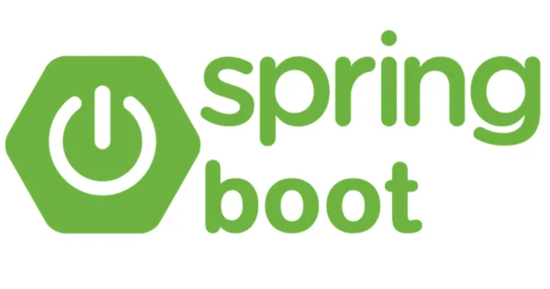

### Привет 👋

---
### Немного обо мне:

 - Меня зовут _Сафиулин Роман_
 - Мне _25 лет_
 - Я _Java-разработчик_ из России, _г. Альметьевск_

---

### Связаться со мной можно:

---

#### Мой стек технологий:

  
  
  
  
  
  
  
  
  
  
  
  
  

---

Хотя backend и скрыт от пользователей, я понимаю насколько важна эта составляющая для цифрового
продукта. Я хотел бы улучшать жизнь пользователей, ведь это так интересно и приятно - видеть как
твоим (или частично твоим) творением пользуются люди (и ты в том числе😄).

Применил принципы ООП, SOLID, паттерны проектирования при разработке проектов:
 - [Task-manager](https://github.com/SafiulinRM/java-sprint2-hw) - REST приложение на основе Java
Core для организации совместной работы над задачами
 - [Filmorate](https://github.com/SafiulinRM/java-filmorate) - REST приложение для работы с базой
фильмов и оценками пользователей
 - [ShareIt](https://github.com/SafiulinRM/java-shareit) - REST приложение для аренды разных вещей
 - [Explore-with-me](https://github.com/SafiulinRM/java-explore-with-me) - REST приложение для организации
событий и участия в них.

---

### Немного статистики:

 
 
 
 

<!--
**SafiulinRM/SafiulinRM** is a ✨ _special_ ✨ repository because its `README.md` (this file) appears on your GitHub profile.
